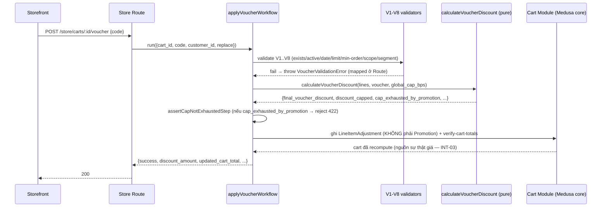
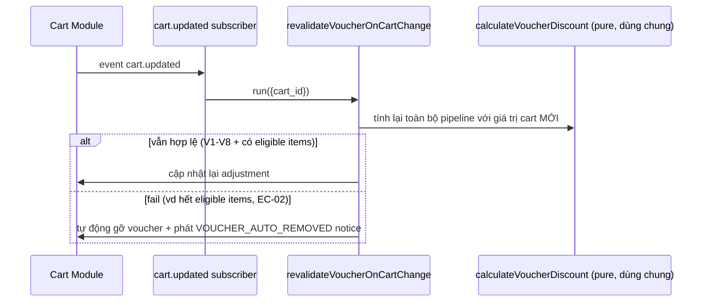
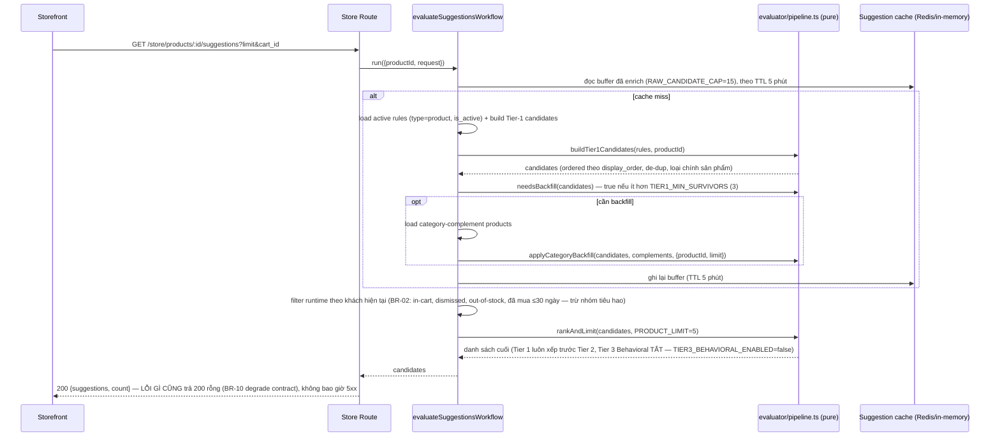
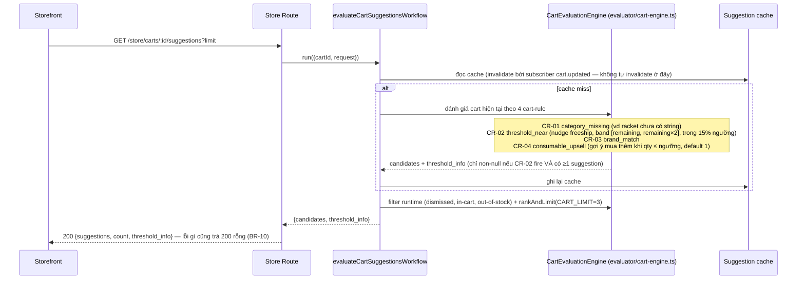
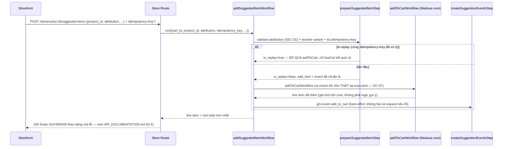

# Technical Specification (as-built) — SuggestiveSelling + VoucherEngine

Tài liệu cặp đôi với [`API_DOCUMENTATION.md`](./API_DOCUMENTATION.md) (route/request/response/mã
lỗi) — tách riêng theo đúng 2 deliverable Phase 6 yêu cầu. Đọc file đó để biết endpoint cụ thể;
đọc file này để hiểu kiến trúc/logic đằng sau chúng.

## Vị trí của tài liệu này

Đây là tài liệu **as-built duy nhất còn được duy trì** cho 2 module — mô tả đúng những gì code
đang làm tại thời điểm viết (sau Phase 5, CR global cap 40%), không phải tài liệu thiết kế/kế hoạch.

`docs/` còn 5 tài liệu voucher khác (`API_CONTRACT_Suggestive_Voucher_Cart.md`,
`TECHNICAL_SOLUTION_DESIGN.md`, `SPEC.md`, `voucher-engine/voucher-engine.solution-flow.completed.md`,
7 file dưới `voucher-engine/diagrams/`) — **tất cả đều là tài liệu planning từ 07-13/07/2026, có
trước cả đợt rebuild Promotion-first (17-21/07/2026)**. Chúng không chỉ lệch số % cap, mà lệch toàn
bộ kiến trúc hiện tại (carrier là raw `LineItemAdjustment`, không phải Promotion; Decision H-2;
v.v.). **Không đọc 5 file đó để lấy số liệu/kiến trúc hiện tại.** Nguồn sự thật là code +
`.claude/specs/voucher-engine/rebuild-decisions.md` + tài liệu này.

Ghi chú thêm: khi viết tài liệu này, phát hiện trong working tree có một thay đổi CHƯA COMMIT
(cùng ngày 2026-07-22, không phải do Phase 5 tạo ra) bổ sung field `cap_exhausted_by_promotion` và
error code `VOUCHER_CAP_EXHAUSTED` — xem §9 mục 2. Tài liệu này mô tả code ĐANG có trên đĩa, kể cả
phần chưa commit đó.

---

## 1. Document Control

|                      |                                    |
| -------------------- | ---------------------------------- |
| Version              | 1.0                                |
| Tác giả              | Claude (Technical Writer, Phase 6) |
| Người review/approve | Chưa review — chờ Thức xác nhận    |
| Ngày cập nhật        | 2026-07-22                         |

---

## 2. Giới thiệu

> **Đối chiếu với checklist "Technical Specifications document" (Slack, 2026-07-22):** tài liệu
> gốc trước bản cập nhật này còn thiếu 6/9 mục dưới — đã bổ sung ở §2.1-2.7 bằng dữ liệu thật, ghi
> rõ N/A ở đâu không có bằng chứng (không suy đoán).
>
> | Mục checklist                             | Ở đâu trong tài liệu                          |
> | ----------------------------------------- | --------------------------------------------- |
> | Technical requirements (functional + NFR) | §4 (functional) + §5 (NFR)                    |
> | Scope                                     | §2 (Mục đích/Phạm vi, ngay dưới)              |
> | Team deadlines & release timeline         | §2.3 (mới)                                    |
> | Development standards                     | §2.4 (mới)                                    |
> | Business goals & objectives               | §2.1 (mới)                                    |
> | Intended impact cho end user              | §2.2 (mới)                                    |
> | Individual tasks & responsibilities       | §2.5 (mới)                                    |
> | Project budget & resource allocation      | §2.6 (mới) — N/A                              |
> | Visual mockups & design architecture      | §2.7 (mới, mockup) + §3 (design architecture) |

- **Mục đích:** mô tả kiến trúc & thiết kế kỹ thuật **as-built** của 2 module custom —
  `voucher-engine` và `suggestive-selling`.
- **Phạm vi:** backend 2 module (Medusa v2) + điểm tích hợp trực tiếp với storefront/admin. **Out
  of scope:** toàn bộ Medusa core module chuẩn (Cart/Order/Product/Pricing/Promotion nội tại — chỉ
  nhắc khi 2 module custom này chạm vào), chi tiết UI storefront/admin (chỉ nhắc endpoint tiêu thụ).
- **Assumptions & Constraints:** Redis là **optional** (module hạ tầng chỉ load khi có
  `REDIS_URL`, fallback in-memory — không được giả định luôn có sẵn); Postgres là DB chính bắt
  buộc; single-tenant store; tiền luôn là integer VND, làm tròn `floor`; timeline gốc 7 ngày, team
  4 dev không phân biệt role (`docs/team/OWNERSHIP.md`).
- **Glossary:** SRS = Software Requirements Specification; V1–V8 = chuỗi validate voucher; EC-xx =
  Edge Case (SRS §8); T-VOUCH-xx/T-SUGG-xx = Acceptance Test (SRS §10); BR-xx = Business Rule
  (SuggestiveSelling); CR-01..04 = Cart Rule (nudge/threshold, SuggestiveSelling — **khác** "CR"
  dùng ở Phase 5 = Change Request, 2 chữ viết tắt trùng nhau nhưng nghĩa khác, cần phân biệt theo
  ngữ cảnh); bps = basis points (1 bps = 0.01%); INT-01..04 = Data Integrity rules (SRS §9.3);
  SEC-01..04 = Security rules (SRS §9.2).
- **Tài liệu tham chiếu:** `docs/Phan-tich-SRS-Suggestive-Selling-Voucher.md` (SRS phân tích),
  `.claude/specs/voucher-engine/rebuild-decisions.md`, `.claude/specs/voucher-engine/SPEC.md`
  (rebuild), [`API_DOCUMENTATION.md`](./API_DOCUMENTATION.md).

### 2.1 Business goals & objectives

Nguyên văn "§1.2 Giá trị kinh doanh" của `docs/Phan-tich-SRS-Suggestive-Selling-Voucher.md`:

- **Tăng giá trị đơn hàng trung bình (AOV):** gợi ý sản phẩm bổ trợ tại trang chi tiết
  ("Complete Your Setup") và giỏ hàng ("You Might Also Need"), có cơ chế đẩy giỏ hàng vượt ngưỡng
  freeship (CR-02).
- **Tăng tỷ lệ chuyển đổi tại checkout:** voucher áp dụng tức thì, báo lỗi cụ thể theo từng điều
  kiện fail (V1-V8), tự động chọn phương án giảm giá hợp lệ tốt nhất.
- **Bảo vệ biên lợi nhuận:** trần giảm giá tổng (mặc định 40% — CR 2026-07-22, trước đó 50%; xem
  §5) chặn kịch bản chồng khuyến mãi làm đơn hàng về 0đ hoặc âm (EC-03). **Đây chính là lý do
  business thật đằng sau global discount cap** — không chỉ là ràng buộc kỹ thuật.
- **Vận hành linh hoạt không cần code:** admin cấu hình suggestion rule & voucher qua API, không
  cần deploy lại.
- **Đo lường được:** analytics đầy đủ vòng đời gợi ý (impression → tap → add_to_cart → dismiss) +
  analytics voucher (`total_uses`, `total_discount_given`, `avg_order_value`, `capped_count`,
  `conversion_rate` — xem `GET /admin/vouchers/:id/analytics`, API_DOCUMENTATION.md §3.2).

### 2.2 Intended impact cho end user

- **Khách mua hàng:** thấy gợi ý sản phẩm liên quan ngay khi xem sản phẩm/giỏ hàng (giảm công tìm
  kiếm phụ kiện đi kèm — vd vợt cầu lông không dây thì được gợi ý dây); áp mã giảm giá tức thì kèm
  thông báo lỗi cụ thể (vd "Mua thêm {remaining} nữa để dùng được mã này" thay vì lỗi chung chung).
- **Admin/vận hành:** tạo/sửa suggestion rule và voucher qua API mà không cần dev can thiệp; xem
  analytics để đánh giá hiệu quả từng rule/voucher.

### 2.3 Team deadlines & release timeline

**Timeline này thuộc về dự án GỐC (SuggestiveSelling + VoucherEngine, xây trong 7 ngày, 4 dev),
KHÔNG phải deadline riêng cho Phase 5/6 (CR cap 40%) — Phase 5/6 diễn ra SAU khi dự án gốc đã hoàn
thành, không có deadline riêng nào được ghi nhận cho nó.**

- Nguồn thật: `docs/tasks_grouped.md` (511 dòng, chia theo Ngày 1–7 × 4 dev: Hùng, Linh, Sơn, Thức)
  - `docs/team/CLAUDE_WORKFLOW.md` ("Days 6–7 grade the project on evidence, not on code that
    'looks done'" — tức Ngày 6-7 là mốc chốt bằng chứng/demo, không phải code mới).
- Không có ngày tháng thật (chỉ "Ngày 1..7" tương đối) — không suy đoán ra ngày dương lịch cụ thể
  nếu tasks_grouped.md không ghi.

### 2.4 Development standards

Không lặp lại nội dung — trỏ thẳng nguồn thật (đã có sẵn, đầy đủ, không cần viết lại):

- `.claude/rules/coding.md` — TypeScript, integer VND + `Math.floor`, spec traceability.
- `.claude/rules/testing.md` — loại test/naming/coverage target.
- `.claude/rules/security.md` — pricing server-side, rate limit, audit immutability.
- `.claude/rules/medusa.md` — hình dạng module, Link Module, models, workflow.
- `docs/team/CLAUDE_WORKFLOW.md` — quy trình per-task: Plan → Build → Verify → Evidence → Review → PR.
- `docs/team/CONTRIBUTING.md` — quy tắc branch/PR/evidence.

### 2.5 Individual tasks & responsibilities

Nguồn thật: `docs/team/OWNERSHIP.md` (4 dev, 1 file = 1 owner):

| Dev      | Domain                                                                                                                                                                                               |
| -------- | ---------------------------------------------------------------------------------------------------------------------------------------------------------------------------------------------------- |
| **Hùng** | VoucherEngine foundation (scaffold/models/migration/service/seed), V1–V8 validation, voucher Admin API, Redis rate-limit                                                                             |
| **Thức** | VoucherEngine discount runtime (monetary calc, pure discount fn, global cap, voucher Store API, revalidation subscriber, usage-recording, checkout integration) — **đây là phần Phase 5/6 thao tác** |
| **Linh** | SuggestiveSelling foundation + product-level tier logic + suggestion Admin API + one-tap-add wiring                                                                                                  |
| **Sơn**  | SuggestiveSelling runtime (event, evaluate workflow, filtering/ranking, cart-level CR-01..04, Store API, cache)                                                                                      |

**Lưu ý lệch tên so với code hiện tại:** OWNERSHIP.md ghi tên file gốc lúc phân công (vd
`stacking-engine.ts`) — code hiện tại đã đổi tên/tái cấu trúc qua đợt rebuild Promotion-first (vd
thành `calculate-discount.ts`). Dùng bảng này để biết AI (ai) phụ trách VÙNG nào, không dùng để
tra path file chính xác — path file thật lấy từ §3/§6 tài liệu này.

### 2.6 Project budget & resource allocation

**N/A — không có bằng chứng nào trong repo** (không có con số ngân sách, chi phí hạ tầng, hay
phân bổ resource dạng tiền tệ ở bất kỳ file nào đã đọc). Đây là dự án nội bộ team 4 người, không
tài liệu hoá budget — không suy đoán ra số liệu không có thật.

### 2.7 Visual mockups

- `docs/voucher-engine-ui/WIREFRAMES.md` (344 dòng) + `docs/voucher-engine-ui/UX-FLOW.md`
  (442 dòng) — wireframe text/ASCII (tự ghi "no visual mockups, no code"), mô tả 1 module
  `EnhancedDiscountCode` hợp nhất (1 input, 1 nút Apply, 1 danh sách applied-codes) cho cả
  Promotion thường lẫn voucher.
- **Cảnh báo lệch kiến trúc:** WIREFRAMES.md mô tả voucher được carry qua **1 ephemeral Medusa
  Promotion** gắn vào `cart.promotions` (`cart.metadata.voucher.ephemeral_promotion_id`) — đây là
  kiến trúc CŨ, đã bị thay bởi Decision-4 carrier rewrite (raw `LineItemAdjustment`, không còn
  ephemeral Promotion nào — xem §3/§9 mục 1). **Phần UX/layout (1 input, 1 danh sách) nhiều khả
  năng vẫn còn giá trị tham khảo, nhưng phần kỹ thuật (ephemeral Promotion) đã lỗi thời** — chưa
  đối chiếu lại với code storefront thật trong phiên này để xác nhận UI hiện tại có khớp wireframe
  hay không, chỉ dừng ở việc phát hiện điểm mâu thuẫn kiến trúc để không đọc nhầm.
- "Design architecture" (phần còn lại của mục checklist này): xem §3 Kiến trúc hệ thống.

---

## 3. Kiến trúc hệ thống

**KHÔNG phải kiến trúc microservices** — toàn bộ backend là **1 Medusa v2 monolith** (1
process/container), 2 module custom chạy trong cùng process với Medusa core. Không có API
Gateway/service mesh riêng.

```
┌─────────────────────────┐      HTTP/JSON       ┌───────────────────────────────────┐
│  Storefront (Next.js 15) │ ───────────────────▶ │  Medusa Backend (1 process)      │
│  apps/storefront          │ ◀─────────────────── │  - Medusa core modules            │
└─────────────────────────┘                        │  - custom: voucher-engine          │
                                                     │  - custom: suggestive-selling      │
┌─────────────────────────┐      HTTP/JSON       │  - Admin dashboard (React, cùng     │
│  Admin Dashboard (React)  │ ───────────────────▶ │    process, không phải service riêng)│
│  apps/backend/src/admin  │ ◀─────────────────── └───────────────┬────────────┬──────┘
└─────────────────────────┘                                       │            │
                                                              Postgres 15    Redis 7
                                                            (bắt buộc, DB    (OPTIONAL —
                                                             chính, port      cache + rate-
                                                             5433→5432)       limit, port
                                                                              6380→6379)
```

- **Breakdown thành phần:**
  - `modules/voucher-engine/` — service (`VoucherEngineService extends MedusaService`), 3 model
    (`VoucherConfig`, `VoucherUsageLog`, `DiscountCapConfig`), pure lib (`calculate-discount.ts`,
    `lib/errors.ts`), workflows (`apply-voucher`, `remove-voucher`, `revalidate-voucher-on-cart-change`,
    `record-voucher-usage`) + steps + admin sub-workflows.
  - `modules/suggestive-selling/` — service, 5 model (`SuggestionRule`, `SuggestionRuleItem`,
    `SuggestionRuleSource`, `CartSuggestionCondition`, `SuggestionEvent`), pure evaluator
    (`evaluator/*` — tier 1/2/3 + cart rules CR-01..04, không I/O), workflows
    (`evaluate-suggestions`, `evaluate-cart-suggestions`, `add-suggested-item`, admin CRUD rule).
  - **Cầu nối 2 module + Medusa core:** Link Module (`links/*.ts`) — id tham chiếu dạng
    `model.text()`, KHÔNG có DB foreign key xuyên module. Event subscriber `cart.updated` là điểm
    giao duy nhất giữa 2 module (VoucherEngine revalidate + SuggestiveSelling cache invalidate),
    **2 module không gọi trực tiếp lẫn nhau** (xem §4).
- **Technology stack:** Medusa 2.16.0 (Node.js + TypeScript), Postgres 15-alpine, Redis 7-alpine
  (optional), Next.js 15 + React 19 (storefront), pnpm 11.8.0 + Turborepo (monorepo). **Không có
  Kubernetes/container orchestration nào** — chỉ `docker-compose.yml` cho Postgres + Redis ở dev
  (xem §8).

---

## 4. Thiết kế chức năng (Functional Design)

### 4.1 Use case → component

| Use case                              | Endpoint                                | Workflow                          | Logic thuần (pure)                                                                                                           |
| ------------------------------------- | --------------------------------------- | --------------------------------- | ---------------------------------------------------------------------------------------------------------------------------- |
| Xem gợi ý ở trang sản phẩm (SUGG-001) | `GET /store/products/:id/suggestions`   | `evaluateSuggestionsWorkflow`     | `evaluator/pipeline.ts` (Tier 1 manual → Tier 2 category backfill; Tier 3 behavioral tắt — `TIER3_BEHAVIORAL_ENABLED=false`) |
| Xem gợi ý ở giỏ hàng (SUGG-004)       | `GET /store/carts/:id/suggestions`      | `evaluateCartSuggestionsWorkflow` | `evaluator/cart-engine.ts` + `cart-rules.ts` (CR-01..04)                                                                     |
| One-tap add (SUGG-003)                | `POST /store/carts/:id/suggested-items` | `addSuggestedItemWorkflow`        | — (I/O: validate attribution, re-check stock, add line item)                                                                 |
| Track hành vi (SUGG-006)              | `POST /store/suggestion-events`         | `createSuggestionEventsWorkflow`  | —                                                                                                                            |
| Áp voucher (VOUCH-001/003)            | `POST /store/carts/:id/voucher`         | `applyVoucherWorkflow`            | `lib/validators.ts` (V1–V8) + `lib/calculate-discount.ts`                                                                    |
| Gỡ voucher (VOUCH-004)                | `DELETE /store/carts/:id/voucher`       | `removeVoucherWorkflow`           | —                                                                                                                            |
| Cart đổi → revalidate (VOUCH-005)     | subscriber `cart.updated`               | `revalidateVoucherOnCartChange`   | cùng `calculate-discount.ts`                                                                                                 |
| Ghi nhận redemption                   | subscriber `order.placed`               | `recordVoucherUsageWorkflow`      | — (atomic `usage_count` + append `voucher_usage_log`)                                                                        |

### 4.2 Business flow chính (sequence)

**Áp voucher (`POST /store/carts/:id/voucher`):**



**Cart thay đổi → revalidate voucher (async, không block request đổi cart):**



**Gỡ voucher (`DELETE /store/carts/:id/voucher`) — `removeVoucherWorkflow`:** đơn giản, không cần
sequence diagram riêng — xoá `LineItemAdjustment` của voucher (`removeLineItemAdjustmentsStep`,
core-flows) + xoá key `voucher` khỏi `cart.metadata` + refetch cart total. Không có voucher active
→ no-op `200` (idempotent). **Không đụng `usage_count`/`voucher_usage_log`** (Rule 12/13) — đây là
điểm quan trọng nhất của flow này, không phải các bước thao tác.

**Ghi nhận redemption (`order.placed` subscriber) — `recordVoucherUsageWorkflow`:** cũng đơn giản
— `assertOrderHasVoucherStep` (no-op nếu order không có voucher, đa số đơn hàng) →
`idempotencyCheckStep` (chặn double-record nếu event `order.placed` bắn 2 lần — dựa vào unique
index `(voucher_id, order_id)`) → `resolveVoucherUsageLimitStep` → `atomicRedeemStep` (tăng
`usage_count` + ghi 1 dòng `voucher_usage_log` trong CÙNG 1 transaction). Đây là **subscriber
DUY NHẤT** tăng `usage_count` — áp/gỡ voucher trên cart không bao giờ chạm vào đó (SPEC §13.3: xác
nhận `completeCartWorkflow` không có hook "after order created" nào khác nhận được order id, nên
subscriber này là điểm trigger CHÍNH, không phải fallback).

**Gợi ý sản phẩm (`GET /store/products/:id/suggestions`) — `evaluateSuggestionsWorkflow`, Tier 1 →
Tier 2 backfill (SUGG-001):**



**Gợi ý giỏ hàng (`GET /store/carts/:id/suggestions`) — `evaluateCartSuggestionsWorkflow`, cart
rules CR-01..04 (SUGG-004):**



**One-tap add (`POST /store/carts/:id/suggested-items`) — `addSuggestedItemWorkflow` (SUGG-003):**



**Track hành vi (`POST /store/suggestion-events`) — `createSuggestionEventsWorkflow`:** đơn giản,
không cần sequence diagram riêng — validate từng event (loại RIÊNG event lỗi, không fail cả batch)
→ ghi `SuggestionEvent` (append-only) → nếu `action:"dismiss"` thì ghi thêm vào dismissal cache.
Fire-and-forget, LUÔN trả `202` kể cả khi có lỗi nội bộ (xem API_DOCUMENTATION.md §3.4).

Cache invalidation cho cả 2 flow gợi ý dùng chung 1 cơ chế: subscriber `cart.updated` (cùng
subscriber revalidate voucher ở trên) gọi `invalidateCartSuggestions` — 2 module không tự gọi
invalidate riêng, tránh trôi lệch giữa nhiều nơi.

**Không có state machine phức tạp** cho cả 2 module — `VoucherConfig.is_active` chỉ là 1 boolean
Enable/Disable toggle (không có trạng thái trung gian như "pending"/"suspended"); `SuggestionRule`
tương tự chỉ có `is_active` + cửa sổ `valid_from`/`valid_to`, không phải state machine.

---

## 5. Non-functional Requirements

- **Performance (target, theo SRS §9 — CHƯA có bằng chứng đã benchmark thật trong repo, không có
  APM/monitoring code):**

  | Metric                    | Target (SRS) |
  | ------------------------- | ------------ |
  | Load gợi ý product-level  | p95 < 800ms  |
  | Đánh giá gợi ý cart-level | p95 < 600ms  |
  | Validate voucher (apply)  | p95 < 400ms  |
  | Recalculate tổng giỏ      | p95 < 300ms  |
  | Cache hit rate gợi ý      | > 85%        |

- **Scalability:** **không có auto-scaling policy nào được cấu hình** — chỉ chạy 1 instance qua
  `docker-compose`/`pnpm dev`. Redis cache (optional) giảm tải DB cho suggestion/voucher-config
  lookup, nhưng không có thiết kế horizontal-scaling nào được tài liệu hoá.
- **Security:** SEC-01 (mọi tính toán discount server-side, client chỉ gửi code), SEC-02 (rate
  limit brute-force voucher, Redis-backed), SEC-03 (voucher code case-insensitive, lưu UPPERCASE),
  SEC-04 (route `/admin/*` yêu cầu admin auth mặc định của framework). **Encryption at
  rest/in-transit:** không có cấu hình riêng trong repo (Postgres/Redis dùng default
  docker-compose, không bật TLS) — thuộc trách nhiệm hạ tầng deploy thật, ngoài phạm vi code. **Compliance
  (VD Nghị định 53/2022):** không có bằng chứng nào về chương trình compliance trong repo — N/A,
  không suy đoán.
- **Availability & SLA:** không có SLA nào được tài liệu hoá. **Disaster Recovery/RTO/RPO:** không
  có kế hoạch DR nào trong repo (không backup script, không runbook) — N/A rõ ràng, cần bổ sung
  nếu lên production thật.

---

## 6. Thiết kế dữ liệu (Data Design)

### 6.1 Sơ đồ quan hệ (tóm tắt, không FK xuyên module — Link Module only)

```
VoucherConfig ──(Link, promotion_id)──▶ Promotion (Medusa core, canonical, không gắn cart)
VoucherConfig ──(1:N)──▶ VoucherUsageLog (append-only, snapshot tại order.placed)
DiscountCapConfig (singleton, độc lập — không liên kết trực tiếp voucher nào)

SuggestionRule ──(1:N)──▶ SuggestionRuleItem, CartSuggestionCondition, SuggestionRuleSource
SuggestionRuleSource ──(Link, product_id)──▶ Product (Medusa core)
SuggestionEvent (độc lập, plain-text id fields — không FK, kể cả tới SuggestionRule đã bị xoá)
```

### 6.2 Data flow

- **Đồng bộ (chủ yếu):** mọi request HTTP → workflow → trả response ngay (không có hàng đợi).
- **Bất đồng bộ (chỉ 1 điểm thật):** event subscriber `cart.updated` (in-process, cùng Node
  process — KHÔNG phải message queue/event bus thực) kích hoạt revalidate voucher + invalidate
  suggestion cache. Redis dùng cho cache (TTL) + rate-limit counter, KHÔNG dùng làm message broker.
- **Migration strategy:** đây là **greenfield build**, không có hệ thống cũ nào để migrate dữ liệu
  từ đó — N/A. Mỗi module tự quản lý Mikro-ORM migration riêng
  (`modules/voucher-engine/migrations/`, `modules/suggestive-selling/migrations/`).

---

## 7. Thiết kế tích hợp (Integration Design)

- **External systems:** **không có** external system nào ngoài chính Medusa core modules (Cart,
  Promotion, Product, Customer Group) mà 2 module custom này gọi qua service container. Payment
  (Stripe) tồn tại ở storefront nhưng ngoài phạm vi 2 module này.
- **Event/message design:** không dùng message broker thực (Kafka/RabbitMQ/SQS). Chỉ dùng cơ chế
  event subscriber built-in của Medusa (in-process). Không có schema versioning cho event vì
  event không rời khỏi process.

---

## 8. Triển khai & Hạ tầng (Deployment & Infrastructure)

- **Environment setup:** chỉ có **dev** được tài liệu hoá — `docker-compose.yml` (root repo) chạy
  Postgres 15-alpine (host port 5433→5432) + Redis 7-alpine (host port 6380→6379, optional); backend
  chạy `pnpm backend:dev` (port 9009), storefront `pnpm storefront:dev` (port 8008). **Không có
  staging/production compose hay config nào trong repo.**
- **CI/CD pipeline:** **không tìm thấy** (`find` không ra kết quả `.github/workflows`,
  `.gitlab-ci.yml`, hay tương đương nào trong repo) — N/A, không suy đoán có pipeline.
- **Infrastructure diagram (cloud/K8s):** N/A — không có evidence nào về cloud provider/K8s trong
  repo, chỉ có docker-compose cho local dev.

---

## 9. Known limitation & thay đổi rất mới (đọc trước khi dựa vào)

1. **Cap chỉ tính trên giá đã sale, không tính trên giá gốc Price List.** `original_subtotal` dùng
   `unit_price` (đã là giá sale nếu sản phẩm nằm trong Price List sale) — không bao giờ đọc
   `compare_at_unit_price` (giá gốc trước sale). Quyết định kiến trúc có chủ đích (Decision H-2,
   `rebuild-decisions.md`), không phải thiếu sót — xem chi tiết + ví dụ số ở
   `.claude/plans/c-requirements-m-i-d-i-keen-dahl.md`.
2. **`VOUCHER_CAP_EXHAUSTED` — bổ sung rất mới, CHƯA COMMIT tại thời điểm viết tài liệu này.**
   `calculateVoucherDiscount()` trả thêm `cap_exhausted_by_promotion: boolean` (true khi
   item/automatic promotion MỘT MÌNH đã ăn hết toàn bộ cap). Step `assertCapNotExhaustedStep` từ
   chối thẳng (`422`) khi khách áp voucher trong tình huống đó — override SRS EC-03/§10.2 ("luôn
   giảm về 0, không bao giờ từ chối"). Chỉ áp dụng luồng apply thủ công, không áp dụng cho preview/
   revalidate. **Cần xác nhận lại với người phụ trách trước khi coi là hành vi chính thức** — có
   thể chính là hướng giải quyết cho gap #3 dưới đây, nhưng chưa có xác nhận nối 2 việc này.
3. **EC-03/T-VOUCH-09 (sàn tối thiểu 1 VND) — gap còn tồn đọng từ Phase 3.** Ghi nhận tại
   `PHASE-3-4-TONG-HOP.vi.md`, chưa fix chính thức, cần team quyết định.
4. **EC-04 (optimistic lock cho concurrent apply-voucher vs xoá item)** — partially done, blocked
   chờ quyết định kiến trúc (Phase 3 audit).
5. **2 error envelope không đồng nhất giữa 2 module** — VoucherEngine dùng
   `{type, code, message, customer_message, details?, request_id?}`; SuggestiveSelling (one-tap
   add) dùng `{code, message, details?}` (không có `type`/`request_id`). Rủi ro cho FE integration
   nếu code dùng chung logic parse lỗi cho cả 2.
6. **T-SUGG-06 (one-tap add E2E)** — chưa implement, thiếu hạ tầng Playwright trong repo.

---

## 10. Testing Strategy

- **Unit test:** `pnpm test:unit` (Jest, `TEST_TYPE=unit`) — pure logic (`calculate-discount.ts`,
  evaluator pipeline, validators), không I/O.
- **Integration test — module:** `pnpm test:integration:modules` — service + migration, real
  Postgres (`moduleIntegrationTestRunner`).
- **Integration test — HTTP:** `pnpm test:integration:http` — full route, real Postgres + Redis.
- **UAT/manual QA:** `docs/qa-test-cases/` — 32 test case (EC-01..10, T-VOUCH-01..12,
  T-SUGG-01..10), audit tổng hợp tại `PHASE-3-4-TONG-HOP.vi.md` (27/32 pass tại thời điểm audit).
- **Performance test:** **không có** load-test tool nào trong repo (không thấy k6/artillery/locust)
  dù SRS có NFR performance target (§5 ở trên) — gap, chưa được đo thật.
- **E2E:** **chưa có** — không cài Playwright/Cypress trong repo (T-SUGG-06 là ví dụ cụ thể bị
  block bởi gap này).

---

## 11. Risk & Mitigation

| Rủi ro                                                                                                             | Mức độ                         | Giảm thiểu đề xuất                                                                                   |
| ------------------------------------------------------------------------------------------------------------------ | ------------------------------ | ---------------------------------------------------------------------------------------------------- |
| EC-03 (sàn 1 VND) chưa quyết định chính thức, có 2 hướng giải quyết đang tồn tại song song (floor về 1đ vs reject) | Trung bình                     | Team họp chốt 1 hướng, cập nhật lại SRS annotation                                                   |
| EC-04 (concurrency lock) chưa xong                                                                                 | Trung bình                     | Cần quyết định kiến trúc trước khi lên production thật (nguy cơ lost-update khi 2 request đồng thời) |
| Không có performance test/APM — target SRS §9 chưa được xác nhận đạt                                               | Trung bình                     | Thêm load-test (k6/artillery) trước khi launch thật                                                  |
| Không có CI/CD — dễ merge code lỗi lên `develop`/`demo`                                                            | Trung bình                     | Thiết lập pipeline chạy `pnpm test:unit`/`test:integration:*` trước merge                            |
| 2 error envelope khác nhau giữa 2 module                                                                           | Thấp                           | Cân nhắc thống nhất 1 envelope chung khi có thời gian refactor                                       |
| Cap không tính giá gốc Price List — có thể gây hiểu lầm nếu business muốn cap tính cả markdown                     | Thấp (đã xác nhận là chủ đích) | Đã flag rõ, chỉ hành động nếu business yêu cầu thay đổi phạm vi                                      |

---

## 12. Phụ lục

- [`API_DOCUMENTATION.md`](./API_DOCUMENTATION.md) — route/request/response/mã lỗi đầy đủ.
- `docs/qa-test-cases/README.md` + 32 file `EC-XX.md`/`T-VOUCH-XX.md`/`T-SUGG-XX.md`.
- `PHASE-3-4-TONG-HOP.vi.md` (Phase 3/4, tóm tắt tại
  `.claude/plans/c-requirements-m-i-d-i-keen-dahl.md`, mục "Tóm tắt các phase trước").
- Nguồn sự thật cho kiến trúc/quyết định đã đổi: `.claude/specs/voucher-engine/rebuild-decisions.md`
  - `.claude/specs/voucher-engine/SPEC.md` (bản rebuild) + code.
- 5 tài liệu lịch sử (KHÔNG dùng để tra cứu hiện tại): `docs/API_CONTRACT_Suggestive_Voucher_Cart.md`,
  `docs/TECHNICAL_SOLUTION_DESIGN.md`, `docs/SPEC.md`,
  `docs/voucher-engine/voucher-engine.solution-flow.completed.md`,
  `docs/voucher-engine/diagrams/*.md`.
