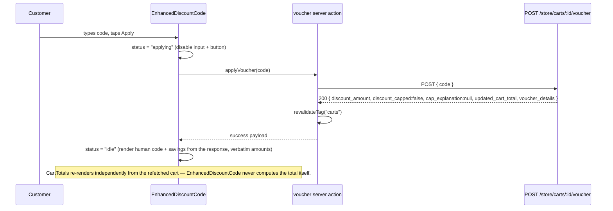
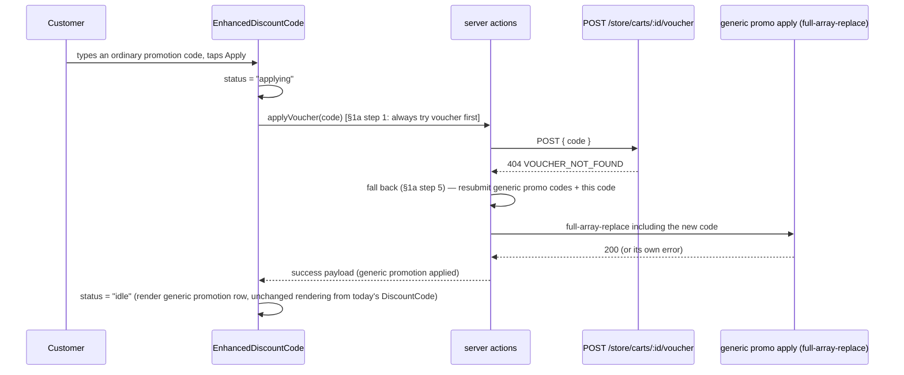
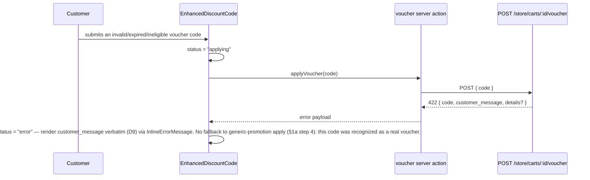
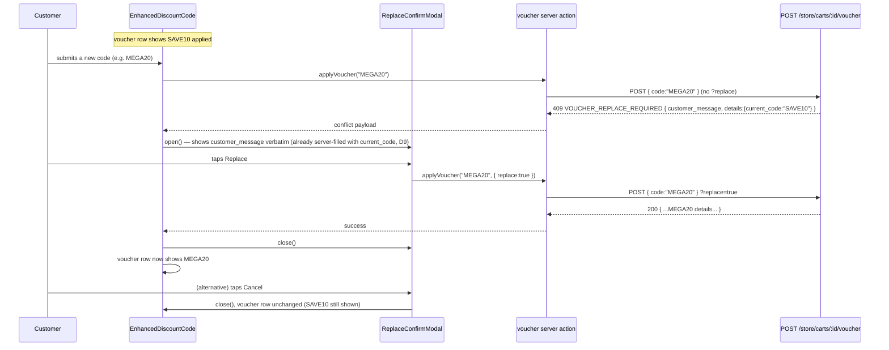
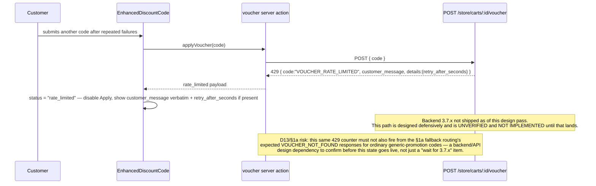

# VoucherEngine Storefront UI — UX Flow (Design Phase)

**Status:** Design resolved, not implemented. This document resolves the open questions raised in `REQUIREMENTS.md` §3/§4 using the approved decisions below, and defines the flows/states the implementation phase must build against.

**Does not cover:** code, component prop signatures, or file diffs. See `WIREFRAMES.md` for layout.

**Revision note (architecture correction):** this revision replaces the earlier design's separate `VoucherPanel` component (rendered beside the existing generic `DiscountCode` component) with **one unified discount-code module** that enhances `DiscountCode` in place. See the revised D3/D4 below and the new §1a routing rule. `REQUIREMENTS.md` §0 has the corresponding architecture rationale.

**Language note:** three distinct things are true at once, and this document must not blur them together:

1. **UI-authored copy is English.** Every label, button, and placeholder this design controls (`Promotion code`, `Apply`, `Available vouchers`, `Remove`, etc.) is written in English, in the docs and in the eventual implementation.
2. **Backend-supplied strings are rendered verbatim, and are currently Vietnamese.** `customer_message` (validation errors, rate-limit messages), the replace-confirmation prompt, `cap_explanation`, and the remove-success `message` all come from the backend and must be displayed exactly as received (D9) — no frontend translation, no frontend authoring. In production today, that means these specific strings appear in Vietnamese even though every UI-authored label around them is English. Every illustrative message in this document (e.g. "This code has expired...") is an **English stand-in** for whatever the backend actually returns, for readability of the doc only.
3. **Fully English customer-facing copy end-to-end is a separate backend task, not a frontend doc or refactor task.** If all customer-facing text should read in English, that requires changing the backend's error/message catalogue (`workflows/voucher-engine/lib/errors.ts`) and `cap_explanation` generation — out of scope for this UI design and for the storefront code refactor it feeds. The frontend cannot and must not paper over this by translating backend strings client-side.

---

## 0. Approved decisions baked into this design

| #   | Decision                                                                                                                                                                                                                                                                                                                                                                                                                                                                                                                                                                                                                   |
| --- | -------------------------------------------------------------------------------------------------------------------------------------------------------------------------------------------------------------------------------------------------------------------------------------------------------------------------------------------------------------------------------------------------------------------------------------------------------------------------------------------------------------------------------------------------------------------------------------------------------------------------- |
| D1  | Hydrate "is a voucher active" from `cart.metadata.voucher` — not from `cart.promotions`.                                                                                                                                                                                                                                                                                                                                                                                                                                                                                                                                   |
| D2  | Add cart-level `metadata` to the storefront's Cart retrieval fields (currently only `items.metadata` is fetched).                                                                                                                                                                                                                                                                                                                                                                                                                                                                                                          |
| D3  | **(Revised)** Enhance the existing generic `DiscountCode` component **in place** — do not build a separate `VoucherPanel`. The resulting component is referred to below as `EnhancedDiscountCode` (equally acceptable: `PromotionCodeModule`, or "`DiscountCode` with Voucher Engine support"). One input, one Apply button, one applied-codes list, for both generic promotions and vouchers.                                                                                                                                                                                                                             |
| D4  | **(Revised)** `EnhancedDiscountCode` renders generic-promotion rows from `cart.promotions`, **excluding** the one entry whose `id === cart.metadata.voucher?.ephemeral_promotion_id`. That excluded entry is instead rendered as the voucher row, sourced from `cart.metadata.voucher` and using the **human** voucher `code` — never the ephemeral entry's own internal code.                                                                                                                                                                                                                                             |
| D5  | Inline messages + the existing `Modal` and banner patterns only. No toast library, no bottom-sheet primitive.                                                                                                                                                                                                                                                                                                                                                                                                                                                                                                              |
| D6  | The available-voucher list is labeled **"Available vouchers"**, never "My vouchers" — the backend has no per-customer targeting yet. **Corrected:** the route is customer-gated (core Medusa `authenticate` middleware on `/store/customers/me*`), not public — guests get `401`, which the frontend degrades to an empty list (`REQUIREMENTS.md` §2). Whether to make it truly public or keep it gated is an open product/backend decision.                                                                                                                                                                               |
| D7  | Mini-cart (`cart-dropdown`) voucher display is out of scope for this design.                                                                                                                                                                                                                                                                                                                                                                                                                                                                                                                                               |
| D8  | After any cart mutation, run a **bounded** refresh strategy (defined in §3) to catch the async `cart.updated` revalidation subscriber. Totals are never computed client-side — every render reads server-supplied fields. This concerns only the voucher row; generic-promotion rows are unaffected by VoucherEngine's revalidation.                                                                                                                                                                                                                                                                                       |
| D9  | Display `customer_message`/`cap_explanation` verbatim. No frontend placeholder interpolation, no frontend translation — whatever the server sends is the string shown, in whatever language it's in (Vietnamese today).                                                                                                                                                                                                                                                                                                                                                                                                    |
| D10 | Support HTTP 429 defensively (the UI state exists, designed against the documented contract shape), but this is **not implemented behavior** — real rate-limit integration stays deferred/speculative until backend task 3.7.x ships **and** until the D13 fallback-routing/rate-limit interaction risk is resolved on the backend side. Do not wire a live path against it yet.                                                                                                                                                                                                                                           |
| D11 | **(New)** Single-input routing rule (§1a): a submitted code is tried against VoucherEngine's apply endpoint first; only a `VOUCHER_NOT_FOUND` (404) response falls back to the existing generic-promotion apply call. Any other VoucherEngine response (success, a business-rule rejection, or `VOUCHER_REPLACE_REQUIRED`) is treated as final — the code was recognized as a real voucher.                                                                                                                                                                                                                                |
| D12 | **(New, restates §3's dependency note)** Bounded reconciliation (D8) surfaces only that the voucher was auto-removed; the human-readable _reason_ text stays deferred/unimplemented unless the backend confirms a metadata channel for it (§7 preserves the exact reasoning) — do not fabricate reason text client-side under any circumstance (already required by D9, restated here for emphasis).                                                                                                                                                                                                                       |
| D13 | **(New — flagged risk, NOT resolved)** D11's fallback routing means every ordinary generic-promotion code produces a `VOUCHER_NOT_FOUND` on its way to the generic-promotion path. Once backend rate limiting ships (3.7.x), a naive counter that increments on every `VOUCHER_NOT_FOUND` (per the SPEC's own "only `VOUCHER_NOT_FOUND` counts" rule) would incorrectly count ordinary generic-promotion attempts toward voucher brute-force cooldown. **This is a backend/API design dependency that must be resolved before enabling live rate-limit UI (D10)** — see §1a for the full reasoning and possible solutions. |

### Resolution of `REQUIREMENTS.md` §4 open questions

| #   | Open question                                   | Resolution                                                                                                                                                                                                                                                                                                                                                                                                                                                      |
| --- | ----------------------------------------------- | --------------------------------------------------------------------------------------------------------------------------------------------------------------------------------------------------------------------------------------------------------------------------------------------------------------------------------------------------------------------------------------------------------------------------------------------------------------- |
| 1   | Voucher hydration on reload                     | **Resolved** — D1 + D2. (Preserved caveat: `cap_explanation`/`expires_at` are not part of that persisted snapshot — §7.)                                                                                                                                                                                                                                                                                                                                        |
| 2   | Interaction with generic promotion UI           | **Resolved (revised)** — D3 + D4: enhance the existing component in place; do not build a second component or a second visible input.                                                                                                                                                                                                                                                                                                                           |
| 3   | Toast vs. banner                                | **Resolved** — D5 (no toast, existing banner/modal only).                                                                                                                                                                                                                                                                                                                                                                                                       |
| 4   | Async revalidation timing                       | **Resolved** — D8 (bounded refresh, defined in §3); reason text stays deferred (D12/§7).                                                                                                                                                                                                                                                                                                                                                                        |
| 5   | Rate-limit UI buildable today?                  | **Resolved** — D10 (design defensively, defer implementation and verification).                                                                                                                                                                                                                                                                                                                                                                                 |
| 6   | "Available vouchers" personalization gap        | **Corrected, still open.** As shipped, the route is **customer-gated (401 for guests)**, not public — verified against the running backend, reversing an earlier "not gated" claim (`REQUIREMENTS.md` §2). The frontend already degrades this gracefully to an empty list (D6/§7). Whether to make the route truly public or keep it gated with a real sign-in state (`WIREFRAMES.md` §2.3) is an open product/backend decision, not resolved by this document. |
| 7   | Mini-cart voucher visibility                    | **Resolved** — D7 (explicitly out of scope).                                                                                                                                                                                                                                                                                                                                                                                                                    |
| 8   | Mobile bottom-sheet                             | **Resolved** — D5 (reuse the existing center `Modal` for both viewports; see `WIREFRAMES.md` §5).                                                                                                                                                                                                                                                                                                                                                               |
| 9   | Concurrency signal for voucher ops              | **Still open** — no new information surfaced this pass. Treated generically: any error envelope with an unrecognized/`conflict` type falls into the same generic `error` state as VOUCH-002, displaying `customer_message` verbatim (D9). No dedicated "lock contention" UI is designed until the backend confirms the exact shape. Flagged again in §6.                                                                                                        |
| 10  | Placeholder interpolation                       | **Resolved** — D9 (verbatim display; any un-filled `{placeholder}` text reaching the customer is a backend defect to fix there, not a frontend workaround).                                                                                                                                                                                                                                                                                                     |
| 11  | (New) Single-input routing rule                 | **Resolved** — D11 (§1a). Latency tradeoff of the two-step fallback is flagged as an open question for the code refactor (`REQUIREMENTS.md` §4 item 11).                                                                                                                                                                                                                                                                                                        |
| 12  | (New) Rate-limit / fallback-routing interaction | **Flagged, NOT resolved** — D13 (§1a). Backend/API design dependency: must be resolved before enabling live rate-limit UI, since D11's routing makes every generic-promotion attempt produce a `VOUCHER_NOT_FOUND` on the way to the fallback path.                                                                                                                                                                                                             |

---

## 1. Component architecture

```
Summary (cart template, "use client")
 ├─ EnhancedDiscountCode (the existing DiscountCode component, EXTENDED in place — D3)
 │   ├─ CodeInputForm             — ONE input + ONE Apply button (handles both generic
 │   │                              promotion codes and voucher codes, §1a routing rule)
 │   ├─ AppliedCodesList          — ONE list, rows merged from two sources:
 │   │   ├─ GenericPromotionRow[] — from cart.promotions, EXCLUDING the entry whose
 │   │   │                          id === cart.metadata.voucher?.ephemeral_promotion_id (D4)
 │   │   └─ VoucherRow            — shown when cart.metadata.voucher is present; renders the
 │   │       │                      HUMAN voucher code + savings, never the ephemeral entry's
 │   │       │                      own internal code
 │   │       └─ CapExplanationBanner — shown when voucher.discount_capped === true
 │   ├─ InlineErrorMessage        — validation / generic error states (reuses ErrorMessage)
 │   ├─ RateLimitBanner           — 429 state (reuses CartMismatchBanner pattern; NOT
 │   │                              implemented behavior yet — D10)
 │   ├─ AutoRemovedBanner         — async auto-removal notice (reuses CartMismatchBanner
 │   │                              pattern; reason text deferred — D12/§7)
 │   ├─ ReplaceConfirmModal       — reuses existing Modal
 │   └─ AvailableVouchersModal    — reuses existing Modal (D6 label "Available vouchers",
 │                                  guest/empty states)
 ├─ Divider
 ├─ CartTotals (existing, unmodified — already renders discount_subtotal/total from server fields)
 └─ Checkout button
```

`EnhancedDiscountCode` is rendered in both the Cart page `Summary` and the Checkout page's own summary (wherever `DiscountCode` is rendered today) — same component, same rules. It is **not** rendered in the mini-cart (D7).

### 1a. Single-input routing rule (new — resolves "how does one input serve two backends?")

The customer never chooses "this is a voucher" vs. "this is a promotion code" — there is one field and one Apply button (`WIREFRAMES.md` §0/§1.1). Internally, a submitted code is routed as follows:

1. **Always try VoucherEngine's apply endpoint first**: `POST /store/carts/:id/voucher { code }`.
2. **200 success** → treat as a voucher. Render the voucher row (§1.4/§1.5 in `WIREFRAMES.md`) from the response.
3. **409 `VOUCHER_REPLACE_REQUIRED`** → a real, currently-valid voucher code, just conflicting with an already-active one. Open `ReplaceConfirmModal` (§5.5). Do **not** fall back to generic-promotion apply — the code was recognized as a voucher.
4. **422 business-rule rejection** (expired, min order not met, no eligible items, segment, stacking conflict) → the code **is** a real voucher, just not currently applicable. Show that `customer_message` verbatim (§1.6 in `WIREFRAMES.md`). Do **not** fall back — falling back would silently reinterpret a recognized-but-rejected voucher code as an unrelated generic promotion attempt, which would be confusing (e.g. an expired voucher code shouldn't quietly also get tried as a garbage promotion code).
5. **404 `VOUCHER_NOT_FOUND`** → the code does not match any `VoucherConfig` at all (this code is deliberately also used for inactive vouchers, anti-enumeration — the UI cannot and must not try to distinguish "doesn't exist" from "is inactive" here; both fall back identically). **Only in this case**, fall back to the existing generic-promotion apply call (full-array-replace, including this new code alongside whatever's already applied). If that also fails, show whatever error the generic-promotion path returns instead.
6. **Any other transport/error** (network failure, 500, unrecognized code) → generic `error` state (§2 below), no fallback attempted.

This keeps the "one input" promise without needing to guess a code's type from its shape, and preserves VoucherEngine's anti-enumeration guarantee (a `VOUCHER_NOT_FOUND` response never confirms or denies whether a code exists beyond "not a usable voucher right now").

**Known tradeoff (flagged for the code refactor, `REQUIREMENTS.md` §4 item 11):** an ordinary generic-promotion code now costs two sequential network round trips (the voucher attempt that 404s, then the generic-promotion call) instead of one. This is a real, if modest, latency cost of unifying the input — confirm it's acceptable, or revisit with a future combined backend lookup if it isn't.

**Risk — rate limiting interaction (D13, flagged, NOT resolved — backend/API design dependency, `REQUIREMENTS.md` §4 item 12):** step 5 above means every ordinary generic-promotion code produces a `VOUCHER_NOT_FOUND` response as a normal, expected part of routing — not a customer mistake. VoucherEngine's own brute-force protection design (SPEC §9.3) counts only `VOUCHER_NOT_FOUND` toward the rate-limit/failed-attempt counter, on the reasoning that every other code implies "a legitimate customer state, not guessing." That reasoning silently breaks once this routing rule ships: a customer who tries several ordinary generic-promotion codes in a row (none of which are vouchers at all) would rack up `VOUCHER_NOT_FOUND` responses through no fault of their own, and — under a naive implementation of the not-yet-shipped rate limiter (task 3.7.x) — could trip voucher cooldown for an entirely unrelated reason.

- **This must be resolved on the backend/API design side before D10's rate-limit UI is enabled live** — the frontend cannot fix it after the fact, since by the time the storefront sees the 404 the backend's counter has already (or hasn't) incremented.
- **Possible future solutions (not decided here, backend's call):**
  - A combined "apply discount code" backend endpoint that itself understands both code families, so a code that was never voucher-shaped doesn't hit — and therefore can't miscount against — the voucher-specific counter at all.
  - A separate, **non-counting** voucher "probe"/lookup call the frontend can use for the §1a fallback check, distinct from the (counted) real apply attempt — so routing a code through the fallback path never touches the brute-force counter.
- Until the backend adopts one of these (or an equivalent), D10 stays "not implemented behavior" for a second, more specific reason beyond "3.7.x hasn't shipped yet": shipping 3.7.x naively, without addressing this, would misfire against ordinary generic-promotion usage.

## 2. Client state model

Conceptual discriminated union (naming only — not a commitment to a specific state library):

```
EnhancedDiscountCodeState =
  | { status: "hydrating" }                                              // first paint, cart not yet resolved
  | { status: "idle" }                                                    // input ready; genericPromotions/voucher below reflect current cart state regardless of this status
  | { status: "applying" }                                               // request in flight (manual input, §1a routing, or from the available-vouchers list)
  | { status: "removingVoucher" }                                        // DELETE /store/carts/:id/voucher in flight
  | { status: "removingGenericCode", code: string }                      // generic full-array-replace resubmission in flight
  | { status: "replace_confirm", currentCode, pendingCode, customerMessage }
  | { status: "error", code, customerMessage }                           // VOUCH-002 + generic conflict (open Q9)
  | { status: "rate_limited", customerMessage, retryAfterSeconds? }      // D10, defensive, NOT implemented behavior yet
  | { status: "reconciling", activeBeforeMutation: AppliedVoucherSnapshot, attemptsLeft } // D8 bounded window
  | { status: "auto_removed", code, customerMessage? }                   // see §3/§7 dependency note

// Rendered independently of `status` above — always current, read fresh from the cart on every render:
genericPromotions: GenericPromotionRow[]   // cart.promotions, filtered per D4 — unaffected by voucher status
voucher: AppliedVoucherSnapshot | null     // hydrated from cart.metadata.voucher (D1), or null if none active

GenericPromotionRow = {
  id, code, is_automatic,
  application_method: { type, value, currency_code }
}  // unchanged shape from today's DiscountCode rendering

AppliedVoucherSnapshot = {
  code, discount_amount, discount_capped,
  discount_type, discount_value,
  cap_explanation,          // ONLY populated immediately after a fresh apply/replace response (§7) —
                             // the persisted cart.metadata.voucher snapshot does NOT include this field
  ephemeral_promotion_id     // internal identifier only, used for the D4 filter — NEVER rendered to the customer
}
```

`genericPromotions` is always derived by filtering `cart.promotions` to exclude the row matching `voucher.ephemeral_promotion_id` — it is never a separate fetch, and it renders independently of whatever `status` the module is currently in (e.g. a validation error on the voucher path does not hide already-applied generic-promotion rows).

## 3. Bounded Cart refresh strategy (resolves D8 / open question 4)

The `cart.updated` → `revalidateVoucherWorkflow` subscriber runs **asynchronously**, outside the request/response cycle of whatever mutation triggered it (add item, remove item, change quantity). The storefront already calls `revalidateTag("carts")` after every such mutation (`src/lib/data/cart.ts`), which forces the _next_ Server Component render to refetch the cart — but that refetch can still race the subscriber and return a cart where the voucher hasn't been re-evaluated yet.

This concerns **only** the voucher row. Generic-promotion rows are not subject to VoucherEngine's revalidation subscriber at all — they only change when the customer explicitly edits the generic code list.

**Strategy:**

1. Before any cart-mutating action fires, `EnhancedDiscountCode` remembers whether a voucher was active (i.e., there was a voucher row to potentially lose).
2. The mutation's own `revalidateTag("carts")` refetch happens as today — this is refresh **#1**, immediate.
3. If a voucher was active pre-mutation, the module enters `"reconciling"` and schedules **up to 2 additional** bounded refetches of cart state (re-invoking the same read path used for hydration — no new endpoint), at approximately **+800ms** and **+2000ms** — total bounded window **~3 seconds**.
4. Each refetch re-derives voucher state purely from the freshly read `cart.metadata.voucher` (D1) — never from a client-side recomputation.
5. As soon as a refetch shows a definitive result (voucher still present with the _same_ `ephemeral_promotion_id` → back to `"idle"` with the voucher row shown; voucher absent → `"auto_removed"`), the module resolves and stops polling early.
6. If the bounded window elapses (3 attempts total) without a definitive change, the module simply keeps the last-known state. **No infinite polling.** The next real interaction (another mutation, a manual apply/remove, or a page reload) will naturally reconcile via the same hydration path (D1/D2).

```mermaid
sequenceDiagram
    participant U as Customer
    participant Cart as Cart page (line items)
    participant SA as cart.ts server actions
    participant Sub as voucher-cart-updated subscriber (async, backend)
    participant EDC as EnhancedDiscountCode (client)

    U->>Cart: removes a line item
    Cart->>SA: deleteLineItem()
    SA->>SA: revalidateTag("carts")
    SA-->>EDC: refetch #1 (immediate) — cart snapshot
    Note over Sub: cart.updated fires independently of the request above
    EDC->>EDC: was a voucher active before mutation? -> yes: enter "reconciling"
    EDC->>SA: bounded refetch #2 (+800ms)
    SA-->>EDC: cart snapshot
    alt voucher still present, same ephemeral_promotion_id
        EDC->>EDC: resolve to "idle" with voucher row shown (resolved early, stop polling)
    else voucher absent
        EDC->>EDC: status = "auto_removed"
    else still ambiguous / transient
        EDC->>SA: bounded refetch #3 (+2000ms, final attempt)
        SA-->>EDC: cart snapshot
        EDC->>EDC: resolve either way; window closes regardless
    end
    Note over EDC: after ~3s, stop automatic refreshing.<br/>Next mutation, manual action, or reload reconciles further drift.<br/>Generic-promotion rows are unaffected throughout this whole flow.
```

**Backend dependency flagged (not resolved by this design pass — see §7 for the full preserved finding):** the _reason text_ for an auto-removal (e.g. "cart no longer meets the minimum order value") is produced inside an async subscriber that never returns a response to the storefront. For `AutoRemovedBanner` to show a real `customer_message` (D9 — verbatim, no frontend authoring), the backend must persist that message somewhere the bounded refresh can read it (e.g., a short-lived `cart.metadata.voucher_removed` snapshot cleared after one read). This is **not confirmed** as of the last implementation session (D12). Until confirmed:

- If the backend field exists and is populated → show it verbatim (D9).
- If it does not exist → the banner shows only the fact of removal ("Promotion code {code} was removed") without a fabricated reason, since D9 forbids frontend-authored business text. This is the graceful-degradation default, not a final design decision — flagged for backend confirmation before implementation. **Keep this deferred; do not build a speculative reason-text UI beyond this fallback.**

## 4. State diagram — `EnhancedDiscountCode`

```mermaid
stateDiagram-v2
    [*] --> Hydrating
    Hydrating --> Idle: cart resolved (voucher row shown if cart.metadata.voucher present, D1)

    Idle --> Applying: submit code (manual, §1a routing)
    Idle --> AvailableListOpen: tap "Available vouchers"
    AvailableListOpen --> Applying: tap a voucher in the list (same §1a routing)
    AvailableListOpen --> Idle: close modal (no selection)

    Applying --> Idle: voucher applied (200) OR generic-promotion fallback applied (200) — voucher/generic row shown
    Applying --> ErrorShown: 404/422 validation error (voucher path with no fallback, OR generic-promotion path failed too)
    Applying --> RateLimited: 429 (defensive, D10 — not implemented behavior yet)
    Applying --> ReplaceConfirmPending: 409 VOUCHER_REPLACE_REQUIRED

    Idle --> Applying: submit a different code while a voucher is active (implicit replace attempt via §1a)
    Idle --> RemovingVoucher: tap "Remove" on the voucher row
    Idle --> RemovingGenericCode: tap "Remove" on a generic-promotion row
    RemovingVoucher --> Idle: 200 success (voucher row gone; any generic rows untouched)
    RemovingGenericCode --> Idle: 200 success (that generic row gone; voucher, if any, untouched — its code is preserved in the resubmitted array, D4)

    ReplaceConfirmPending --> Applying: confirm (retry with ?replace=true)
    ReplaceConfirmPending --> Idle: cancel (voucher row, if any, unchanged)

    ErrorShown --> Idle: dismiss
    RateLimited --> Idle: dismiss / cooldown shown

    Idle --> Reconciling: cart mutation event, only when a voucher WAS active (bounded refresh, D8)
    Reconciling --> Idle: refresh confirms voucher still present
    Reconciling --> AutoRemoved: refresh confirms voucher cleared
    AutoRemoved --> Idle: dismiss banner

    note right of Reconciling
        Only entered when a voucher
        WAS active before the mutation.
        Bounded to ~3s / 2 extra refetches (D8).
        Generic-promotion rows are never
        affected by this state.
    end note

    note right of RateLimited
        Defensive only (D10) — not
        implemented behavior, not
        verifiable until backend 3.7.x ships.
    end note
```



## 5. Sequence diagrams

### 5.1 Manual apply — happy path, voucher (uncapped)



### 5.1b Manual apply — happy path, generic promotion (§1a fallback)



### 5.2 Manual apply — capped

Same as 5.1, except the 200 payload has `discount_capped: true` and a non-null `cap_explanation`. `EnhancedDiscountCode` renders the voucher row **plus** `CapExplanationBanner` showing `cap_explanation` verbatim (D9) — no client-side cap-percentage math.

### 5.3 Manual apply — validation error (VOUCH-002, voucher path, no fallback per §1a step 4)



### 5.4 Available-voucher selection ("Available vouchers")

```mermaid
sequenceDiagram
    participant U as Customer
    participant EDC as EnhancedDiscountCode
    participant M as AvailableVouchersModal
    participant SA as voucher server action
    participant List as GET /store/customers/me/vouchers
    participant Apply as POST /store/carts/:id/voucher

    U->>EDC: taps "Available vouchers"
    EDC->>M: open()
    M->>SA: fetchAvailableVouchers()
    SA->>List: GET (auth headers if logged in)
    alt authenticated customer
        List-->>SA: 200 { vouchers: [...] } — all active vouchers, not personalized (REQUIREMENTS.md §2)
    else guest (no valid session/bearer)
        List-->>SA: 401 Unauthorized — core Medusa's authenticate() middleware on /store/customers/me* rejects this BEFORE the route handler runs (verified against the running backend, REQUIREMENTS.md §2)
    end
    SA->>SA: fetchAvailableVouchers() catches ANY failure (incl. this 401) and resolves to [] — no special-casing of the 401
    alt list has entries (authenticated, vouchers exist)
        SA-->>M: render list (code, description, value, min_order, valid_to, categories)
    else list is empty (guest — 401 degraded to [] — OR authenticated with zero vouchers)
        M->>M: render "no vouchers available right now" empty-state — a guest sees exactly this, indistinguishable from a real empty list
    end
    Note over M: A distinct guest-specific "sign in to view" state (WIREFRAMES.md §2.3) is NOT current<br/>behavior — the frontend doesn't currently detect the 401 specifically, so it can't render this<br/>prompt today. Whether to add that detection, or make the backend route truly public instead,<br/>is an open product/backend decision — do not implement §2.3 until that's decided.
    U->>M: taps a voucher row
    M->>EDC: applyVoucher(code)  [reuses the exact §1a routing / flow in 5.1/5.2/5.3 — this is already known to be a voucher code, so it will resolve on the first call]
    EDC->>SA: applyVoucher(code)
    SA->>Apply: POST { code }
    Apply-->>SA: 200 or error
    SA-->>EDC: result
    EDC->>M: close() on success; keep open with inline error on failure
```

### 5.5 Replace confirmation



### 5.6 Remove — voucher row vs. generic-promotion row (two different calls, one shared list)

```mermaid
sequenceDiagram
    participant U as Customer
    participant EDC as EnhancedDiscountCode
    participant SA as server actions
    participant VoucherAPI as DELETE /store/carts/:id/voucher
    participant PromoAPI as generic promo apply (full-array-replace)

    alt Remove tapped on the VOUCHER row
        U->>EDC: taps "Remove" on the voucher row
        EDC->>EDC: status = "removingVoucher"
        EDC->>SA: removeVoucher()
        SA->>VoucherAPI: DELETE
        VoucherAPI-->>SA: 200 { success, updated_cart_total, message }
        SA->>SA: revalidateTag("carts")
        SA-->>EDC: success
        EDC->>EDC: status = "idle" — voucher row gone; generic rows, if any, untouched
    else Remove tapped on a GENERIC-PROMOTION row
        U->>EDC: taps "Remove" on a generic-promotion row
        EDC->>EDC: status = "removingGenericCode"
        EDC->>SA: removeGenericPromotionCode(code)
        Note over SA: resubmits the full code array MINUS this code, but the voucher's<br/>ephemeral code (if any) is preserved in that array (D4) — the voucher is never detached by this path.
        SA->>PromoAPI: full-array-replace
        PromoAPI-->>SA: 200
        SA->>SA: revalidateTag("carts")
        SA-->>EDC: success
        EDC->>EDC: status = "idle" — that generic row gone; voucher row, if any, untouched
    end
```

### 5.7 Rate limited (429, defensive — D10, NOT implemented behavior yet)



## 6. Cross-cutting notes

- **Guest vs. authenticated:** manual code entry, Replace, and Remove are identical for guests and logged-in customers. **The "Available vouchers" list is NOT identical** — it is customer-gated (core Medusa `authenticate()` on `/store/customers/me*` returns 401 for guests, verified against the running backend, `REQUIREMENTS.md` §2), not public. The frontend degrades this gracefully today (a guest's 401 collapses into the same empty-list state an authenticated customer with zero vouchers would see, §5.4) rather than crashing or showing an error — but this is NOT the same as the route being public, and it must not be described that way. Regardless of gating, do not label or design the list as "My vouchers" — there is no per-customer targeting. Whether to make the route truly public or keep it gated with a real sign-in state (`WIREFRAMES.md` §2.3) is an open product/backend decision.
- **Loading state:** before cart hydration completes, `EnhancedDiscountCode` renders a skeleton reusing the existing `skeleton-code-form` pattern — do not flash an "idle, nothing applied" state that then pops into showing applied codes once `cart.promotions`/`cart.metadata.voucher` resolve.
- **Empty state:** "nothing applied and nothing available" still renders the input form; the "Available vouchers" trigger may be hidden or shown-with-empty-modal — a copy decision for `WIREFRAMES.md`, not a logic branch.
- **Never client-compute totals (D8):** `EnhancedDiscountCode` only ever displays amounts that arrived verbatim in a server response or in `cart.metadata.voucher`; `CartTotals` remains the single place `cart.total`/`discount_subtotal` are rendered, unmodified. This applies equally to generic-promotion amounts (unchanged from today) and voucher amounts.
- **Open item carried forward (Q9):** concurrent-write conflict handling for the voucher routes specifically is still unconfirmed against real backend behavior — treated as a generic `error` state for now (§2). Revisit once confirmed.
- **Suggested-item stacking (VOUCH-003):** no dedicated UI branch — a suggested-item line participates in voucher eligibility/discount exactly like any other line, per the backend's design (`REQUIREMENTS.md` §3).
- **Do not implement rate-limit UI as live behavior (D10)** and **do not add mini-cart voucher display (D7)** — both stay explicitly out of scope for this design pass, restated here since they're easy to accidentally scope-creep into once a single component exists.
- **Rate-limit UI has a second, more specific blocker beyond "3.7.x hasn't shipped" (D13, §1a):** the §1a routing rule makes every generic-promotion attempt produce a `VOUCHER_NOT_FOUND`, which is also the one code VoucherEngine's own brute-force counter increments on. Do not enable D10's rate-limit UI even after 3.7.x ships until this specific interaction is confirmed resolved on the backend side — otherwise ordinary generic-promotion usage could trip voucher cooldown.

## 7. Known backend realities carried forward from implementation (preserve these — do not re-litigate without new evidence)

These are concrete findings from an earlier implementation pass against the real shipped backend, kept here because they materially constrain the design above:

1. **`cart.metadata.voucher`'s persisted snapshot does not include `cap_explanation` or `expires_at`.** Both fields exist only in the apply-response envelope (`ApplyVoucherResult`), at the moment of a successful apply/replace call. This is why `AppliedVoucherSnapshot.cap_explanation` in §2 above is documented as populated only "immediately after a fresh apply/replace response" — it is not a durable part of the hydrated state.
2. **Consequence: after a page reload, the capped state can be restored as a boolean but not as explanatory text.** `cart.metadata.voucher.discount_capped` survives a reload (it's part of the persisted snapshot); `cap_explanation` does not. A reloaded page can therefore know "this voucher was capped" but cannot show _why_ until the backend is changed to persist that text too (a backend follow-up item, out of scope for this documentation pass and for the storefront to work around unilaterally).
3. **`GET /store/customers/me/vouchers` returns all active/current vouchers to an authenticated customer, not a truly personalized list — but the route itself is customer-gated, not public.** There is no per-customer targeting/assignment model in the backend, so every logged-in customer sees the same set of currently-valid vouchers (why the list is labeled "Available vouchers" (D6), not "My vouchers"). **Corrected (verified against the running backend, supersedes an earlier "even guests see this, not gated" claim which was wrong):** core Medusa's `authenticate("customer", ["session","bearer"])` middleware on the wildcard path `/store/customers/me*` returns `401` for guests — this custom route inherits that framework-level gate regardless of what its own handler code does. The frontend degrades this gracefully (an empty list, §5.4/§6) rather than erroring, but that is a client-side fallback, not evidence the route is public. Whether to make it genuinely public or keep it gated is an open product/backend decision (§6).

---

_Design phase stops here for manual review. No code was written or modified._
